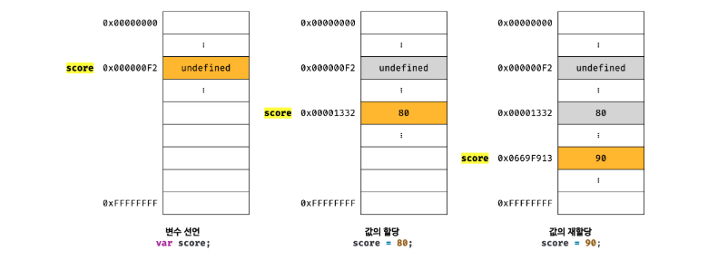

# 11장 원시 값과 객체의 비교

> 원시 값은 변경 불가능한 값이다. 이에 비해 객체는 변경 가능한 값이다.
>

> 원시 값을 갖는 변수를 다른 변수에 할당하면 
원본의 원시 값이 복사되어 전달된다. 이를 값에 의한 전달이라고 한다.
> 

> 이에 비해 객체 값을 갖는 변수를 다른 변수에 할당하면
원본의 참조 값이 복사된어 전달된다. 이를 참조에 의한 전달이라고 한다.
> 

# 11.1 원시 값

- 원시 값은 절대 바뀌지 않는다.

    -> 변경이 가능한건 변수이며, 메모리에 저장된 원시 값을 변수에 할당 하는 것뿐이다.
 



→ score 변수를 만들고 값을 할당하고 재할당하면 새로운 메모리 공간에 새로운 값이 저장된다.

→ undefined, 80이라는 원시 값을 바꿀 수 없기 때문.

## 11.1.1 문자열과 불변성

> 자바스크립트는 다른 언어와 다르게 원시 타입인 문자열 타입을 제공한다.
때문에 문자열 또한 변경 불가능하다.
> 

```jsx
var str = 'Hello';
str = 'world';

-> 메모리 공간에 'world'가 생성되고 변수 str이 world를 가르키게 된다.
-> 기존 원시 값 'Hello'가 바뀌는게 아니다. 
```

- 문자열은 유사 배열 객체이면서 이터러블이다.
    1. 유사 배열 객체란 마치 배열처럼 인덱스로 프로퍼티에 접근할 수 있고, legnth 프로퍼티를 갖는 객체이다. 
    2. 원시 값을 객체처럼 사용하면 원시 값을 감싸는 래퍼 객체로 자동 변환된다.
    
    ```jsx
    var str = 'string';
    
    // 1. 문자열은 유사 배열이므로 인덱스를 사용해 문자에 접근할 수 있다.
    console.log(srt[0]); // s
    
    // 2. 원시 값인 문자열이 객체처럼 동작
    console.log(srt.length); // 6
    console.log(srt.toUpperCase()); // STRING
    
    // 문자열의 불변성
    str[0] = 'S' 
    
    console.log(str) // string 
    ```
    
### 래퍼 객체?
- JavaScript에서 변수에 string, number, bigint, boolean, symbol 타입의 변수를 생성하거나 참조하면, 해당 값을 래핑하는 래퍼 객체를 **임시적으로** 생성해준다.
        
        ```jsx
        /* 내가 작성한 소스 코드 */
        var str = 'string';
        
        console.log(str.length);       // 6
        console.log(str.indexOf('s')); // 0
        
        /* JavaScript 엔진이 해석하는 소스 코드 */
        var str = new String('string');
        
        console.log(new String(srt).length);       // 6
        console.log(new String(str).indexOf('S')); // 0
        ```
        
    
- 임시적으로 생성된 래퍼 객체는 가비지 컬렉터에 의해 회수된다.
        
        ```jsx
        var str = 'string';
        str.name = 'change';
        
        console.log(str.name); // undefined
        ```
        

## 11.1.2 값에 의한 전달

> 원시 값을 가진 변수를 다른 변수에 할당하면 
새로운 메모리 공간에 원시 값이 생성되어 서로 간섭할 수 없다. 
→ 서로 다른 메모리 공간.
> 

```jsx
var score = 80;

var copy = score;

console.log(score == copy) // true
console.log(score === copy) // false
```


# 11.2 객체

- 객체는 변경 가능한 값.
- 객체가 할당된 변수는 재할당 없이 객체를 직접 변경할 수 있다.
→ 여러 개의 식별자가 하나의 객체를 공유할 수 있다
- 객체를 만들어 변수에 할당하면 변수에는 객체가 실제로 저장된 공간의 주소가 저장된다.

```jsx
var person = { 
	name : 'Lee'
};

console.log(person); // {name : 'Lee'}
```


```jsx
peson.name = 'Kim';
person.address = 'Seoul'

console.log(person); // {name : 'Kim', address : 'Seoul'}
```


## 11.2.1 JavaScript 객체의 관리 방식

- Java, C++ 같은 클래스 기반 객체지향 프로그래밍 언어는 객체를 생성하기 전에 이미 프로퍼티와 메서드가 정해져 있고, 이를 토대로 객체를 생성한다.
    1. class를 만들어두고 객체를 만든다.
    2. 객체가 생성된 이후 프로퍼티를 추가, 삭제 할 수 없다.

- 그러나 JavaScript는 클래스 없이 객체를 생성할 수 있고, 
객체가 생성된 이후에도 동적으로 프로퍼티와 메서드를 추가할 수 있다.

## 11.2.2 얇은 복사와 깊은 복사

얇은 복사, 깊은 복사로 생성된 객체는 원본과는 다른 객체 
→ 원본과 복사본은 참조 값이 다른 별개의 객체

얇은 복사 : 객체에 중첩되어 있는 객체의 경우 참조 값을 복사

깊은 복사 : 객체에 중첩되어 있는 객체까지 모두 복사해서 원시 값처럼 완전한 복사본을 만든다.

```jsx
const o = { x : { y: 1 } };

const thinCopy = { ...o };

console.log(o === thinCopy) // false
console.log(o.x === thinCopy.x) // true

// Lodash - clonedeep 함수, npm i lodash
const clonedeep = require("lodash.clonedeep");

const deepCopy = clonedeep(o);

console.log(o === deepCopy) // false
console.log(o.x === deepCopy.x) // false
```

## 11.2.3 참조에 의한 전달

```jsx
var person = { 
	name : 'Lee'
};

ver copy = person;
```


### 하나의 객체를 공유할 경우 발생하는 부작용

```jsx
console.log(person === copy); // true;

copy.name = 'Kim';

person.address = 'Seoul';

console.log(person); // { name : 'Kim', address : 'Seoul'}
console.log(copy); // { name : 'Kim', address : 'Seoul'}
```

### 값에 의한 전달? , 참조에 의한 전달?

- 결국 식별자가 기억하는 메모리 공간에 있는 값이 **원시 값**이냐 **참조 값**이냐의 차이.
 

- 참조에 의한 전달이 아니라 **값에 의한 전달만이 존재**한다고 할 수 있다.
