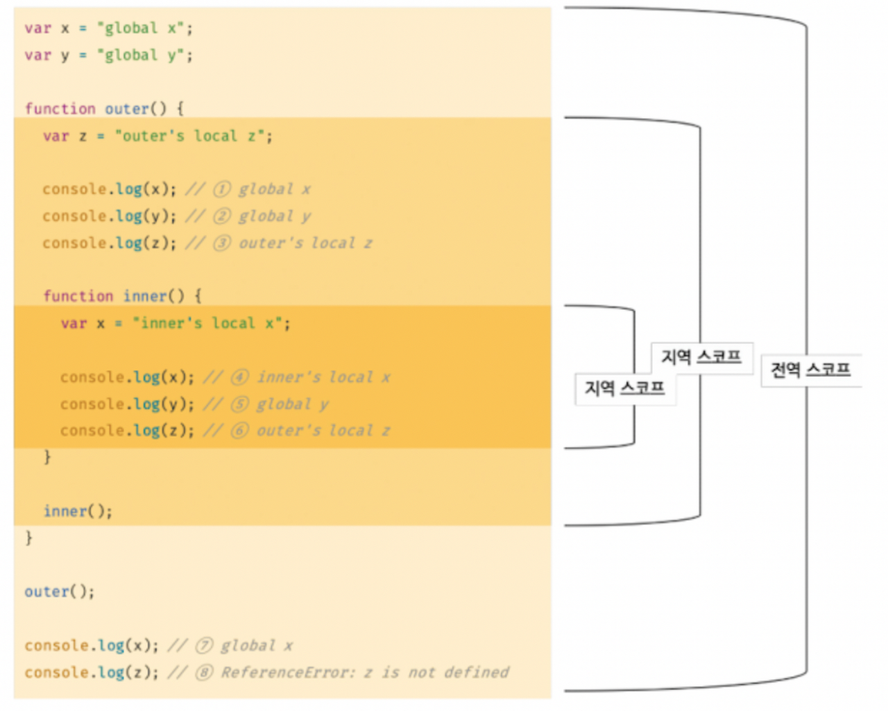

# 13장 스코프

# 11.1 스코프란?

> 유효범위, 자신이 선언된 위치에 따라 다른 코드가 자신을 참조할 수 있는 유효 범위이다.

```jsx
var x = "global";

function foo() {
  var x = "local";
  console.log(x); // local
}

foo();

console.log(x); // global
```

- JS 엔진이 두 개의 x 중 어떤 변수를 참조할지 결정하는 것을 **식별자 결정**이라고 한다.
- 이러한 식별자 결정을 할때 사용하는 규칙을 **스코프**라고 할 수 있다.

# 11.2 스코프의 종류

> 스코프는 선언된 위치에 따라 유효한 범위인 스코프가 결정된다.



### 전역과 전역 스코프

전역은 코드의 가장 바깥 영역이고, 전역 변수는 어디서든지 참조할 수 있다.

### 지역과 지역 스코프

지역은 함수 몸체 내부를 뜻하고, 지역 변수는 지역 스코프와 하위 지역 스코프에서 유효하다.

## 11.2.1 스코프 체인

```jsx
var x = "global x";

function outer() {
  var y = "outer local y";
  function inner() {
    var x = "inner local x";
  }
  inner();
}
outer();
```

위와 같은 경우 전역 스코프에, outer 지역 스코프, inner 지역 스코프가 아래와 같은 계층적 구조로 이루어져 있다.


- 이러한 스코프 체인을 통해 JavaScript 엔진은 변수를 참조하는 스코프에서 시작하여 선언된 변수를 찾는다.
- 스코프 체인은 ‘식별자를 검색하는 규칙’

## 11.2.2 함수 레벨 스코프, 블록 레벨 스코프

> var 키워드로 선언된 변수는 함수 레벨 스코프
> let, const 키워드는 블록 레벨 스코프이다.

### 함수 레벨 스코프

```jsx
var x = 1;

if (true) {
  var x = 10;
}

console.log(x); // 10

for (var x = 0; x < 5; x++) {
  console.log(x); // 0,1,2,3,4
}

console.log(x); // 4
```

### 블록 레벨 스코프

```jsx
let x = 1;

if (true) {
  let x = 10;
}

console.log(x); // 1

for (let x = 0; x < 5; x++) {
  console.log(x); // 0,1,2,3,4
}

console.log(x); // 1
```

## 11.2.3 렉시컬 스코프

- 렉시컬 스코프( =정적 스코프)는 함수가 평가되는 시점에서 상위 스코프가 정적으로 결정된다.

```jsx
var x = 1;

function foo() {
  var x = 10;
  bar();
}

function bar() {
  console.log(x);
}

foo(); // 1
bar(); // 1
```

foo에서 호출한 bar 함수는 전역에서 정의되었고, 때문에 변수 x의 출력 값은 전역에 정의되어있는 값인 1이 나온다.

⇒ 따라서 JavaScript는 어디서 호출 했는지가 아닌 함수를 어디서 정의했는지에 따라 상위 스코프가 결정되고, 상위 스코프는 언제나 **자신이 정의된 스코프가 된다!!**
