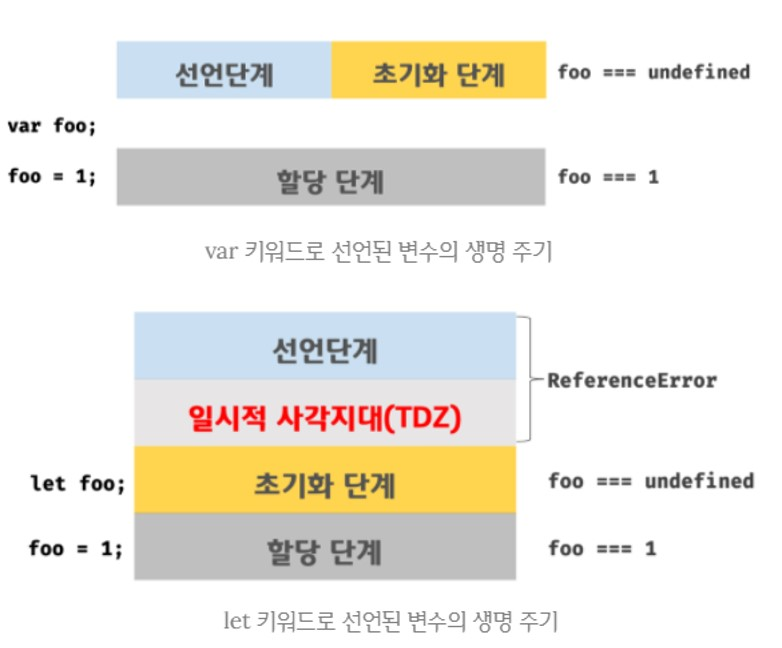

# 15장 let, const 키워드와 블록 레벨 스코

> 앞서 말한 13장에서 var은 함수 레벨 스코프, let과 const는 블록 레벨 스코프라고 설명했다!

# 15.1 var 키워드로 선언한 변수의 문제점

> ES5까지 let, const 키워드가 없었기 때문에 중복 선언 허용, 함수 레벨 스코프, 변수 호이스팅과 같은 특징으로 문제가 발생할 수도 있었다.

### 15.1.1 변수 중복 허용

```jsx
var x = 1;
var y = 1;

var x = 100;
var y; //초기화문이 없는 변수 선언문은 무시

console.log(`${x}, ${y}`); // 100, 1
```

이와 같은 상황에서도 오류가 발생하지 않기 때문에 코드를 작성하며 주의해야한다.

### 15.1.2 함수 레벨 스코프

> var 키워드로 선언한 변수는 함수의 코드 블록만을 지역 스코프로 인정한다.
> 때문에 함수 외부에서 var 키워드로 선언한 변수는 코드 블록 내에서 선언해도 모두 전역 변수가 된다.

```jsx
var x = 1;

if (true) {
  var x = 100;
}
console.log(x); // 100

for (var x = 0; x < 5; x++) {
  console.log(x); // 0,1,2,3,4
}
console.log(x); // 5
```

### 15.1.3 변수 호이스팅

> var 키워드에 변수를 선언하면 선언한 변수는 변수 선언문 이전에 참조할 수 있다.
> 단, 할당문 이전에 참조하면 언제나 undefined가 반환된다.

```jsx
console.log(foo); // undefined

foo = 123;

console.log(foo); // 123

var foo;
```

# 15.2 let의 특징

### 15.2.1 변수 중복 선언 금지

```jsx
var x = 1;
var x = 100;

let y = 2;
let y = 200; // Uncaught SyntaxError: Identifier 'y' has already been declared
```

### 15.2.2 블록 레벨 스코프

```jsx
let x = 1;

if (true) {
  let x = 100;
}
console.log(x); // 1

for (let x = 0; x < 5; x++) {
  console.log(x); // 0,1,2,3,4
}
console.log(x); // 1
```

### 15.2.3 변수 호이스팅

> let 키워드로 선언된 변수는 변수 호이스팅이 발생하지 않는 것처럼 동작한다.

```jsx
console.log(foo); //  foo is not defined

let foo;
```

- var 키워드로 선언된 변수는 런타임 이전, JavaScript 엔진에 의해 “선언 단계” , “초기화 단계”가 한번에 진행된다.
- 하지만 let 키워드는 “선언 단계” , “초기화 단계”가 분리되어 진행된다.
  let 키워드를 선언했을 때 초기화 시작 시점부터 변수를 참조할 수 없는 구간을 TDZ ‘일시적 사각지대’ 라고 부른다.
      

### 15.2.3 전역 객체와 let

> var 키워드로 선언한 전역 변수와 전역 함수, 그리고 선언하지 않은 변수에 값을 할당한 암묵적 전역은 전역 객체 window의 프로퍼티가 된다.

```jsx
// 브라우저 환경

var x = 1;

y = 2;

function foo() {}

console.log(window.x); // 1
console.log(window.y); // 2
console.log(window.foo); // ƒ foo() {}
```

하지만 let 키워드로 선언한 전역 변수는 전역 객체의 프로퍼티가 아니다! 즉, [window.foo](http://window.foo) 와 같이 접근할 수 없다.

# 15.3 Const의 특징

> const는 상수를 선언하기 위해 사용된다. 그러나 꼭 상수만을 위해 사용하진 않는다.
> 대부분의 특징은 let과 동일하다.

### 15.3.1 선언과 초기화

> const 키워드로 선언한 변수는 반드시 선언과 동시에 초기화해야 한다.

```jsx
const foo = 1;

const foo2; //Uncaught SyntaxError: Missing initializer in const declaration
```

### 15.3.2 재할당 금지

```jsx
const foo = 1;
foo = 2; // Uncaught SyntaxError: Identifier 'foo' has already been declared
```

### 15.3.3 상수

> const 키워드로 선언한 변수에 원시 값을 할당한 경우 변수 값을 변경할 수 없다!

```jsx
const TAX_RATE = 0.1; // 대문자로 상수임을 명확히 나타낸다.

let preTaxPrice = 100;

let afterTaxPrice = preTaxPrice + preTaxPrice * TAX_RATE; // 110
```

### 15.3.4 const 키워드와 객체

> const에 선언된 변수에 원시 값을 할당한 경우 변경할 수 없다.
> 하지만 객체를 할당한 경우에는 값을 변경할 수 있다.

```jsx
const person = {
  name: "Lee",
};

person.name = "park";

console.log(person); // { "name": "park" }
```

person에 저장된 객체의 **참조 값**은 변하지 않기 때문에, 객체의 내용은 변경할 수 있다!

# 15.4 var, let, const

> 그럼 언제, 어느 상황에서 각각의 키워드가 적절할까?

1. ES6 환경에서는 var은 최대한 자제한다.
2. 재할당이 필요한 경우에만 let을 사용하고, 변수의 스코프는 최대한 좁게 만든다.
3. 변경이 발생하지 않는 변수(읽기 전용)는 const 키워드를 사용한다.

> 개발을 하며 재할당을 하는 경우는 은근 드물다.
> 때문에 일단 const로 사용해보고, 이후 let 키워드로 변경해도 늦지 않는다.
