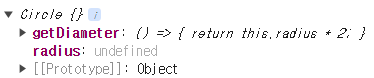

# 17장 생성자 함수에 의한 객체 생성

## 17.1 Object 생성자 함수

```jsx
const person = new Object();

person.name = "Lee";
person.sayHello = function () {
  console.log("Hello");
};

const strObj = new String("Lee");
console.log(typeof strObj); // object
console.log(strObj); // String {"Lee"}

const arr = new Array(1, 2, 3);
console.log(typeof arr); // object
console.log(arr); // [1,2,3]

const date = new Date();
console.log(typeof date); // object
console.log(date); // Mon Apr 29 2024 17:52:16 GMT+0900 (GMT+09:00)
```

여기서 `new Object()`를 통해 빈 객체가 생성되고, 프로퍼티 또는 메서드를 추가할 수 있다.

또한, `Object` 생성자 함수 이외에도 `String, Number, Array, Date` 등 빌트인 생성자 함수가 있다.

## 17.2 생성자 함수

> 객체 리터럴을 이용한 객체 생성은 직관적이고 간편하다.
> 하지만 많은 객체를 만들어야하고, 프로퍼티를 지정해야하는 경우 비효율적일 수 있다.

```jsx
//객체 리터럴
const circle1 = {
  radius: 5,
  getDiameter() {
    return this.radius * 2;
  },
};
console.log(circle1); // {radius: 5, getDiameter: ƒ}

//생성자 함수
function Circle(r) {
  this.radius = r;

  this.getDiameter = () => {
    return this.radius * 2;
  };
}

const circle2 = new Circle(10);
console.log(circle2); // Circle {radius: 10, getDiameter: ƒ}
```

### 17.2.1 생성자 함수의 인스턴스 생성 과정

```jsx
function Circle(r) {
  console.log(this); // Circle {}
  this.radius = r;

  this.getDiameter = () => {
    return this.radius * 2;
  };
}

const circle = new Circle(5);
console.log(circle); // Circle {radius: 5, getDiameter: ƒ}
```

위와 같은 과정에서 `Circle` 객체를 생성할 때 다음과 같은 인스턴스가 생기고, 이 인스턴스(빈 객체)는 `this`에 바인딩 된다.



이 후 `this`에 접근하여 `this`의 인스턴스를 초기화 시키고, 완성된 `this`를 반환한다.


```jsx
function Circle(r) {
  console.log(this); // Circle {}
  this.radius = r;

  this.getDiameter = () => {
    return this.radius * 2;
  };

  return {};
}
const circle = new Circle(5);
console.log(circle); // {}
```

명시된 반환값이 있다면 `this`가 아닌 명시적인 값을 반환하지만, 하지만 이는 곧 생성자 함수의 기본 동작을 훼손하기 때문에 생성자 함수 내에서 `return` 문은 반드시 생략해야 한다.

### 17.2.2 내부 메서드 [[Call]] 과 [[Construct]]

> 함수는 일반 객체와는 다르게 new 연산자와 함께 호출할 수 있다.
> 이는 함수 객체와 일반 객체가 동일하게 가지고 있는 내부 슬롯, 메서드 이외에 추가적으로 가지고 있는 내부 슬롯 `[[Environment]], [[FormalParameters]]` 와 `[[Call]] [[Construct]]` 때문이다.

```jsx
function foo() {}

foo(); //일반적인 함수로서 호출 : [[Call]]이 호출

new foo(); //생성자 함수로서 호출 : [[Construct]]이 호출
```

`[[Call]]` 을 갖는 함수 객체를 callable, `[[Construct]]` 를 갖는 함수 객체를 constructor, 갖지 않는 함수 객체를 non-constructor라고 한다.

모든 함수 객체는 `callable`이면서, `constructor`이거나 `non-constructor`이다.
즉, 모든 함수 객체는 호출할 수 있지만, 생성자 함수로는 호출할 수 없을 수도 있다.

### constructor, non-constructor 구분법

constructor : 함수 선언문, 함수 표현식, 클래스

non-constructor : 화살표 함수

```jsx
function a() {}
const b = function() {};
const c = {
	x : function () {}
};

new a(); // a {}
new b(); // b {}
new c.x(); // x {}
---------------------------------------------------------------
const d = () => {};
const e = {
	x() {}
};

new d(); // Uncaught TypeError: d is not a constructor
new e.x(); // Uncaught TypeError: e.x is not a constructor

```

### 17.2.3 new 연산자 new.target과 instanceof

생성자 함수가 new 연산자 없이 호출되는 것을 방지하기 위해 `new.target / instanceof`와 같은 방법이 있다.

```jsx
function Circle(r) {
  if (!new.target) {
    return new Circle(r);
  }
  this.radius = r;

  this.getDiameter = () => {
    return this.radius * 2;
  };
}
Circle(5); // Circle {radius: 5, getDiameter: ƒ}

function Circle(r) {
  if (!(this instanceof Circle)) {
    return new Circle(r);
  }
  this.radius = r;

  this.getDiameter = () => {
    return this.radius * 2;
  };
}
Circle(5); // Circle {radius: 5, getDiameter: ƒ}
```
